# Despliegue de una aplicación en "Cluster" con NodeJS y Express

## Contenidos
- [Preparación de la máquina](#preparación-de-la-máquina)
- [Aplicación sin clústeres](#aplicación-sin-clústeres)
- [Aplicación con clústeres](#aplicación-con-clústeres)
- [Métricas de rendimiento](#métricas-de-rendimiento)
- [PM2](#pm2)

## Preparación de la máquina

Se prepara una provisión simple en Debian 12 a través de *Vagrantfile*:
```Vagrantfile
# -*- mode: ruby -*-
# vi: set ft=ruby :

Vagrant.configure("2") do |config|
  config.vm.define "practica" do |p|
      p.vm.box = "debian/bookworm64"
      p.vm.hostname = "practica"
      p.vm.network "forwarded_port", guest: 8080, host: 8080
      p.vm.network "private_network", ip: "192.168.12.12"
  end # practica
end # cofig
```

Se levanta la máquina:  
`vagrant up`

Se conecta al servidor mediante SSH:  
`vagrant ssh`

Actualizar los repositorios:  
`sudo apt update`

Instalar node.js:  
`sudo apt install nodejs npm -y`

## Aplicación sin clústeres

En el directorio personal *home/vagrant*:  
`mkdir noClusterApp`

Dentro del directorio creado:  
```bash
npm init

npm install express
```


Se crea la aplicación:  
`nano noCluster.js`

Contenido:
```bash
const express = require("express");
const app = express();
const port = 3000;
const limit = 5000000000;

app.get("/", (req, res) => {
        res.send("Hello World!");
});

app.get("/api/:n", function (req, res) {
        let n = parseInt(req.params.n);
        let count = 0;

        if (n > limit) n = limit;

        for (let i = 0; i <= n; i++) {
                count += i;
        }

        res.send(`Final count is ${count}`);
});

app.listen(port, () => {
        console.log(`App listening on port ${port}`);
});
```

Se inicia la aplicación:  
`node noCluster.js`

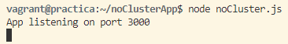

Accediendo a *http://192.168.12.12:3000*:


Accediendo a *http://192.168.12.12:3000/api/50*:
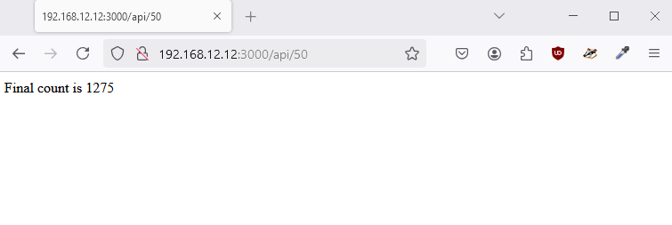

Accediendo a *http://192.168.12.12:3000/api/5000000000*:


Comparación tiempo que tardan las solicitudes en procesarse:
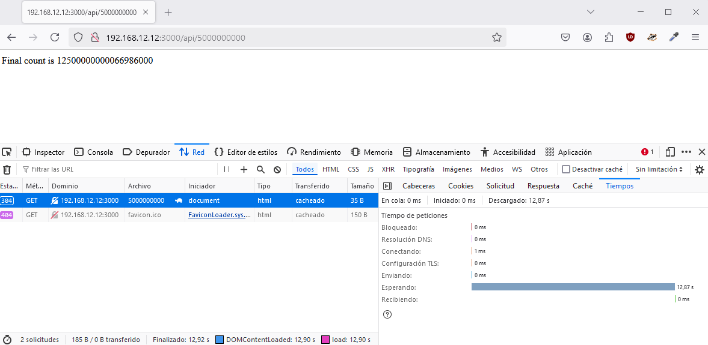
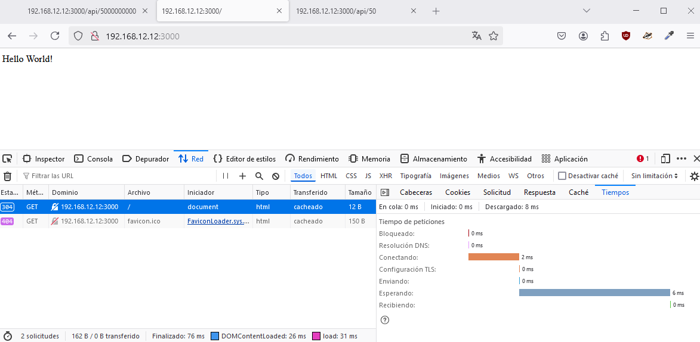
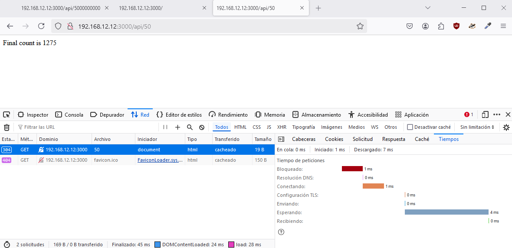

## Aplicación con clústeres

En el directorio personal *home/vagrant*:  
`mkdir clusterApp`

Dentro del directorio creado:  
```bash
npm init

npm install express
```

Se crea la aplicación:  
`nano cluster.js`

Contenido:
```bash
const express = require("express");
const port = 3000;
const limit = 5000000000;
const cluster = require("cluster");
const totalCPUs = require("os").cpus().length;

if (cluster.isMaster) {
    console.log(`Number of CPUs is ${totalCPUs}`);
    console.log(`Master ${process.pid} is running`);
    // Fork workers.
    for (let i = 0; i < totalCPUs; i++) {
        cluster.fork();
    }

    cluster.on("exit", (worker, code, signal) => {
        console.log(`worker ${worker.process.pid} died`);
        console.log("Let's fork another worker!");
        cluster.fork();
    });
} else {
    const app = express();
    console.log(`Worker ${process.pid} started`);

    app.get("/", (req, res) => {
        res.send("Hello World!");
    });

    app.get("/api/:n", function (req, res) {
        let n = parseInt(req.params.n);
        let count = 0;

        if (n > limit) n = limit;

        for (let i = 0; i <= n; i++) {
            count += i;
        }

        res.send(`Final count is ${count}`);
    });

    app.listen(port, () => {
        console.log(`App listening on port ${port}`);
    });
}
```

Se inicia la aplicación:  
`node cluster.js`

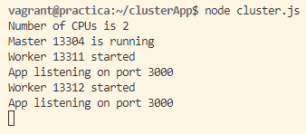

Accediendo a *http://192.168.12.12:3000/api/5000000000*:
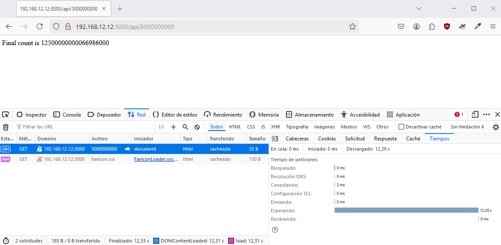

Accediendo a *http://192.168.12.12:3000/api/50*:
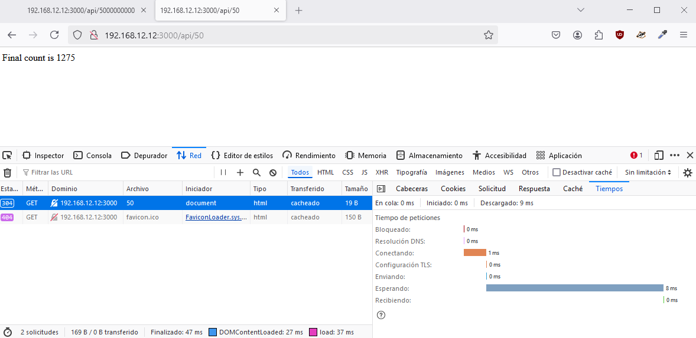

## Métricas de rendimiento

Se instala globalmente *loadtest* en */home/vagrant*:  
`sudo npm install -g loadtest`

### Aplicación sin clústeres

Se ejecuta la aplicación a probar:  
`node noClusterApp/noCluster.js`

En otra terminal, accediendo a la máquina de nuevo, se realiza la prueba de carga:  
`loadtest http://localhost:3000/api/500000 -n 1000 -c 100`
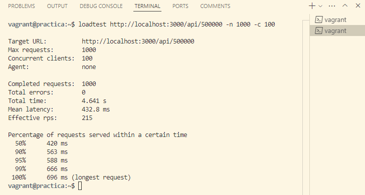

`loadtest http://localhost:3000/api/500000000 -n 1000 -c 100`
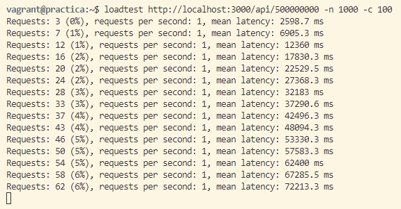

### Aplicación con clústeres

Se ejecuta la aplicación a probar:  
`node clusterApp/cluster.js`

En otra terminal, accediendo a la máquina de nuevo, se realiza la prueba de carga:  
`loadtest http://localhost:3000/api/500000 -n 1000 -c 100`
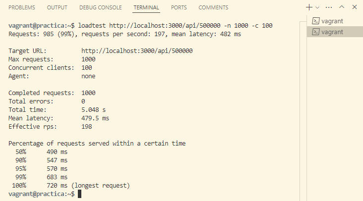

`loadtest http://localhost:3000/api/500000000 -n 1000 -c 100`
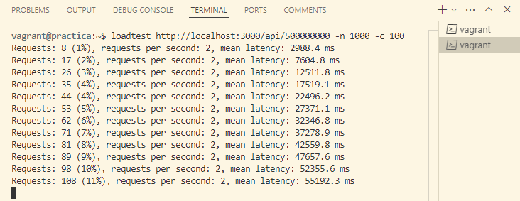

## PM2