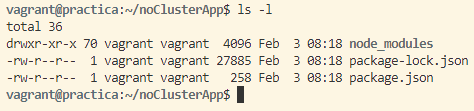
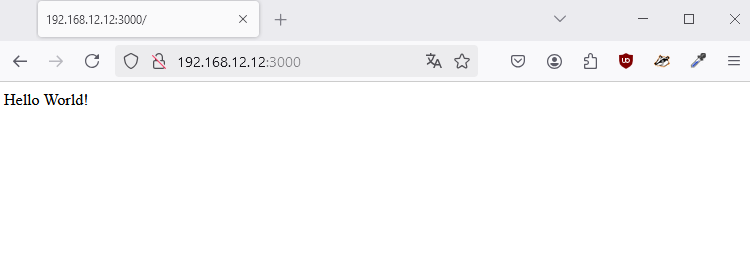
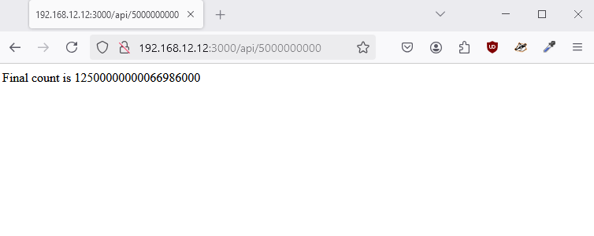

# Despliegue de una aplicación en "Cluster" con NodeJS y Express

## Contenidos
- [](#preparación-de-la-máquina)

## Preparación de la máquina

Se prepara una provisión simple en Debian 12 a través de *Vagrantfile*:
```Vagrantfile
# -*- mode: ruby -*-
# vi: set ft=ruby :

Vagrant.configure("2") do |config|
  config.vm.define "practica" do |p|
      p.vm.box = "debian/bookworm64"
      p.vm.hostname = "practica"
      p.vm.network "forwarded_port", guest: 8080, host: 8080
      p.vm.network "private_network", ip: "192.168.12.12"
  end # practica
end # cofig
```

Se levanta la máquina:  
`vagrant up`

Se conecta al servidor mediante SSH:  
`vagrant ssh`

Actualizar los repositorios:  
`sudo apt update`

Instalar node.js:  
`sudo apt install nodejs npm -y`

## Aplicación sin clústeres

En el directorio personal *home/vagrant*:  
`mkdir noClusterApp`

Dentro del directorio creado:  
```bash
npm init

npm install express
```



Se crea la aplicación:  
`nano noCluster.js`

Contenido:
```bash
const express = require("express");
const app = express();
const port = 3000;
const limit = 5000000000;

app.get("/", (req, res) => {
        res.send("Hello World!");
});

app.get("/api/:n", function (req, res) {
        let n = parseInt(req.params.n);
        let count = 0;

        if (n > limit) n = limit;

        for (let i = 0; i <= n; i++) {
                count += i;
        }

        res.send(`Final count is ${count}`);
});

app.listen(port, () => {
        console.log(`App listening on port ${port}`);
});
```

Se inicia la aplicación:  
`node noCluster.js`


Accediendo a *http://192.168.12.12:3000*:


Accediendo a *http://192.168.12.12:3000/api/50*:


Accediendo a *http://192.168.12.12:3000/api/5000000000*:


Comparación tiempo que tardan las solicitudes en procesarse:


